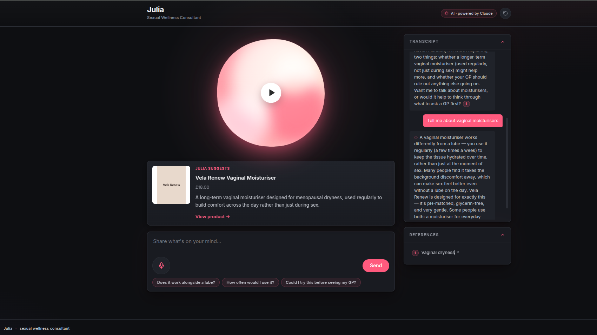

# Julia

A voice-first sexual wellness consultant. Web (Whisper STT + ElevenLabs TTS) and
phone (Vapi) talk to the same Claude-backed conversation engine.

This is a demo / portfolio project, not a deployed service. The product catalogue
is fictional, the practitioner directory is fictional, and the retrieval corpus
ships empty — you bring your own.

## Screenshots

**Title slide of the demo deck**


**Web app — live conversation, product surfaced contextually**



## What it does

- Listens to a user describe a real sexual-wellness concern (menopause,
  low libido, painful sex, intimacy and partner dynamics).
- Replies with general, non-clinical guidance grounded in a curated corpus of
  trusted sources (NHS, British Menopause Society, Women's Health Concern, etc).
- Surfaces a product when — and only when — the user has expressed a specific
  need a product addresses; surfaces a UK sex therapist when a human professional
  is the right answer; defers to the GP when a referral is the right answer.
- Refuses to engage with under-18 questions (third-party or first-party) and
  signposts to **Brook**. Refuses dosing/medication-naming and crisis content,
  signposts to the appropriate helpline.

## How it's built

| Layer | Tool |
| --- | --- |
| Conversation brain | Anthropic Claude (tool use + prompt caching) |
| Speech-to-text | OpenAI Whisper |
| Text-to-speech | ElevenLabs |
| Phone channel | Vapi (custom-LLM webhook → same engine) |
| Retrieval | OpenAI `text-embedding-3-large` + cosine similarity over a small NPZ index |
| Backend | FastAPI (Python 3.11) |
| Frontend | Plain HTML / vanilla JS / CSS — no framework |

## Quick start

```bash
cp .env.example .env
# fill in ANTHROPIC_API_KEY, OPENAI_API_KEY, ELEVENLABS_API_KEY,
# ELEVENLABS_VOICE_ID. Vapi keys optional (only for phone channel).

uv venv --python 3.11
source .venv/bin/activate
uv pip install -r requirements.txt

# build a retrieval corpus (see "Bring your own corpus" below) — without it,
# Julia has nothing to ground factual claims on
python scripts/fetch_corpus.py
python scripts/index_corpus.py

uvicorn server.main:app --reload --port 8765
```

Then open http://localhost:8765.

## Bring your own corpus

`scripts/fetch_corpus.py` reads URLs from `data/corpus/sources.txt` and writes
clean markdown into `data/corpus/`. `scripts/index_corpus.py` then embeds those
markdown files into `data/corpus_index.npz` for cosine retrieval at turn time.

Neither the corpus nor the index ships in this repo — you'll need to add a
`sources.txt` of your own (one URL per line, `#` for comments). See
`docs/julia-implementation-plan.md` §6 for source-selection guidance.

## Documents

The planning docs in [`docs/`](docs/) are working artifacts from the build:

- [`docs/julia-spec.md`](docs/julia-spec.md) — what Julia does (product spec)
- [`docs/julia-architecture.md`](docs/julia-architecture.md) — how the system is shaped (roles, data flow)
- [`docs/julia-tech-stack.md`](docs/julia-tech-stack.md) — which specific tools fill each role
- [`docs/julia-implementation-plan.md`](docs/julia-implementation-plan.md) — the build broken into phases
- [`docs/julia-stage-demo-script.md`](docs/julia-stage-demo-script.md) — stage-demo runbook (web channel)
- [`docs/julia-phone-test-script.md`](docs/julia-phone-test-script.md) — phone-channel test runbook

A reveal.js deck of the project is in [`presentation/`](presentation/).

## Layout

```
server/   FastAPI backend (conversation engine, channel adapters, safety, tools)
data/     products.json (fictional), practitioners.json (fictional), corpus/ (BYO)
scripts/  Offline scripts (corpus fetch + index, conversation test, prewarm)
web/      Frontend (HTML/JS/CSS)
presentation/  reveal.js demo deck
docs/     Planning artifacts
```

## What this isn't

- Not production-ready. No auth, no rate limiting, no persistent storage,
  in-memory session state.
- Not multi-user. Single-process FastAPI, in-memory session dict.
- Not load-tested.
- Not a real service. The product catalogue (`Vela`-branded) is fictional.
  The practitioner directory uses Ofcom drama-reserved phone numbers and
  example.com URLs.

## License

MIT.
